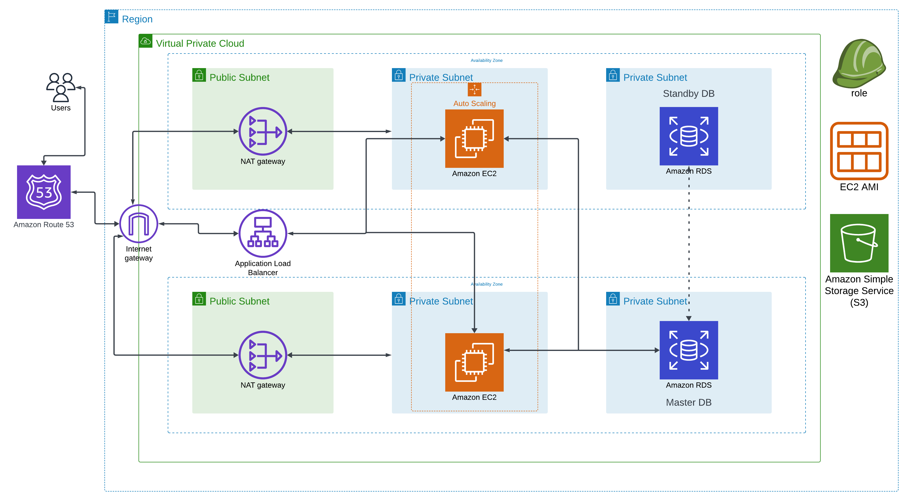

# AWS-Wordpress-Hosting

In this project, we are deploying a Wordpress website on AWS. We use some core AWS technologies and design an architecture to display how these tools work with each other.

## AWS Technologies

  
Click to expand

##
  
  - VPC 
  - EC2 
  - RDS Database
  - Internet Gateway
  - Amazon Route 53
  - NAT Gateway
  - Application Load Balancer
  - Auto Scaling Group
  - S3 Bucket
  - IAM

## Architecture Diagram

### Explanation of Diagram
- We use 2 availability zones for high availability and fault tolerance
- EC2 instances are protected in the private subnets and can be accessed via the NAT gateways for protected internet connection
- User requests and responses follow the internet gateway, to the ALB, to the instances, and the master DB and back.
- We have 1 master DB and 1 standby DB, the master DB handles all main operations while the standby is synchronized.

## Project Setup
### 1. Set up the VPC
  - Go to the AWS console and create a VPC
  - Use all default settings for "VPC only" but add a name tag (mine is MyVPC) and change the IPV4 CIDR to 10.0.0.0/16
  - After it is created, select it, go to "Actions", click "Edit VPC settings" and make sure both DNS settings are enabled
### 2. Set up an Internet Gateway
  - Go to the Internet gateway section and create an Internet gateway
  - Add a name tag (mine is myInternetGateway)
  - After it is created, select it, go to the "Actions" dropdown select "Attach to VPC" and attach it to the VPC we just made
### 3. Set up Public Subnets
  - Create one subnet under the VPC just made, name it Public Subnet 1, choose one of the AZs, and the IPV4 subnet CIDR block should be 10.0.0.0/24
  - For the other public subnet, repeat the steps but change the name to Public Subnet 2, choose the other AZ, and the IPV4 should now be 10.0.1.0/24
  - The next thing to do is for each of these subnets, go to "Actions", edit the subnet settings, and then enable the auto-assign IPV4 addresses
### 4. Set up Private Subnets
  - Follow the same procedures as above, but following the architecture we need to have 2 private subnets in each AZ, one for the instance and one for the database
  - Name them accordingly, and make sure to switch the IPV4 subnet CIDR blocks, from 10.0.2.0/24 to 10.0.5.0/24
  - Once these are created, if you filter just the VPC we made, there should be a total of 6 subnets.
### 5. Set up Public Route Table
  - Create a route table under the VPC we made and name it, mine is Public Route Table
  - Next, we are going to edit the routes of the route table. Edit routes, and then add another route under the 0.0.0.0/0 destination with the target being our internet gateway we made
  - Then, associate the 2 public subnets we made through the Subnet Associations tab
### 6. Create the NAT Gateways
  - We will create 2 NAT Gateways, one for each public subnet
  - Name them accordingly for each AZ and create the NAT Gateway in each respective public subnet we created
  - Allocate an elastic IP as well for each NAT Gateway
### 7. Set up Private Route Tables
  - We will create 2 route tables for each NAT gateway
  - Name them respectively for each AZ
  - Edit the routes like before for the public route tables, but instead of the target being the internet gateway make it the respective NAT Gateway
  - After the routes are done, associate the respective instance and data subnets as done before

